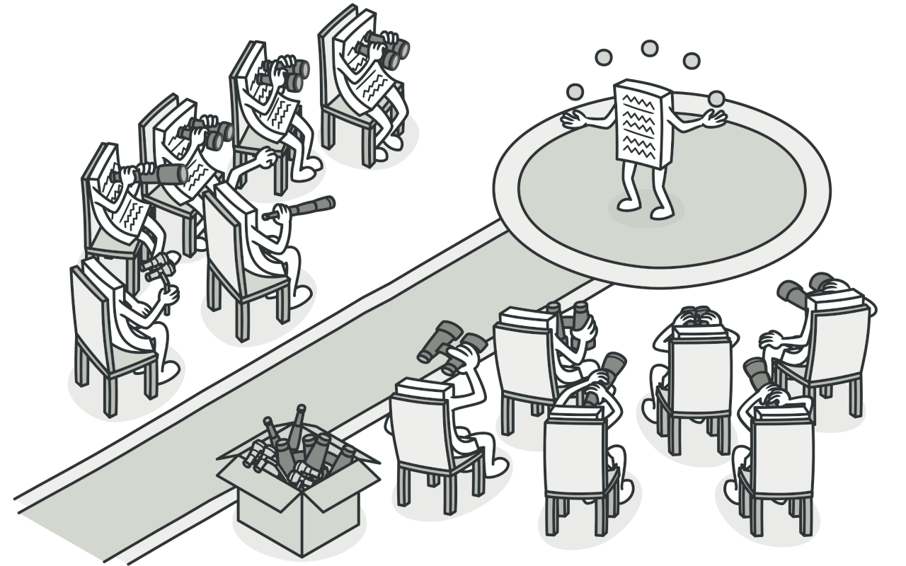

# 观察者模式



对象之间的1对多及时响应，发布者对象的特定事件发出，对其感兴趣的观察者收到响应并做出动作，观察者模式就是用于解耦这一切的.

```md

            +----------------+           +-----------<--  +------------+
            |  发布者        |           |                | 观察者 1   |
            +----------------+  表达兴趣 |                +------------+
            |  主题或者事件  | <---------+
            +----------------+           |
            |  通知          |           |
            +----------------+           +-----------<-- +------------+
      事件或主题发生则通知所有的观察者                   | 观察者 2   |
                                                         +------------+
```

> 实现方式并没有确切的模板代码，根据需要自行实现即可. 事件发生可以是由发布者发出通知，也可以由观察者主动轮询事件是否发生


## 通知式观察者模式

据此可以拆分出发布者需要具备什么特质

    +----------------+                                         +-----------------------+
    |    发布者      |                                         |       订阅者          |
    +----------------+                                         +-----------------------+
    |  subject       |  主题或者事件，订阅者感兴趣             |      response         |  --- 当订阅者收到发布者的通知时做出的反应
    +----------------+                                         +-----------------------+
    |  add_observer  |  添加对自身主题感兴趣的订阅者
    +----------------+
    | remove_observer|  移除对自身主题感兴趣的订阅者
    +----------------+
    |   notify       |  当主题发生或者改变等状态改变，
    +----------------+  发出通知

    > 主题的类型是任意的，几乎所有的类型都可以


```rust
pub trait Subscriber {
    pub fn response();
}

pub trait Publisher {
    pub fn add_observer(subscriber: Subscriber);
    pub fn remove_observer(subscriber: Subscriber);
    pub fn notify();
}
```
